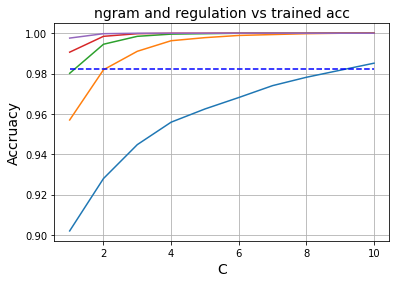
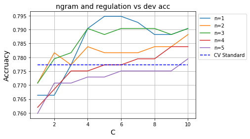
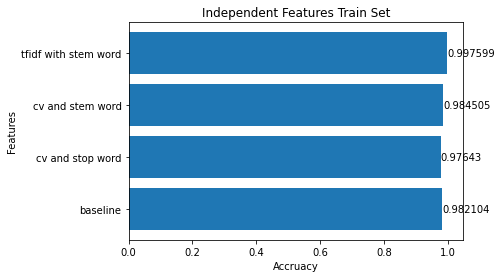
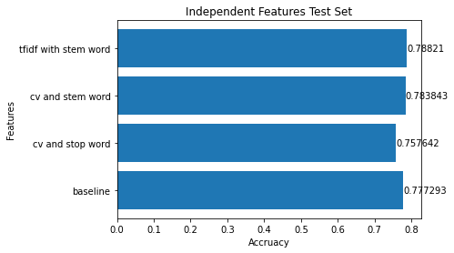

# Assignment 1: Text Classification

## Guided Feature Engineering

For this experiment, I have replaced  the vectorizer with TfidfVectorizer and tried ngram from `(1, 1)` to `(1, 5)`, and also adjust C in range of `[1, 10]`. The following graph represent final accuracy over these model. 

> Note: both graph share same legend

Based on the result, it seems that the `n=1, C=6` yields the best test result, at around 79.5% which is higher than the baseline. Other n's also yields better result than baseline, based on test result set. The improvement could be benefit from the way tfidf counts word, eliminate some of the noise.

We can see that the larger the C is, the less constraint/regulation over the model, and reflected on the training accuracy, we can see that most of the model reach 100% accuracy with larger C. However, these model does not necessary have better performance on test set. The larger the n is, the more model would like to overfit, possibly due to the number of word combinations/feature set increased, and model has fit too much on the noise. 

## Independent Feature Engineering 

In this section, I have tried the following changes:

1. Use CountVectorizer and remove stop words 
2. Different tokenizer, stemming words and remove punctuation
3. Combined tfidf with tokenizer mentioned in (2)

The idea behind this is to get rid of the noise so that Vectorizer would have smaller but more useful word spaces. However, stemming words could also potentially break the meaning of the sentences and cause false positive. The result is listed below.

The result shown that the default CV with embedded "english" stop word has failed behind the baseline, while stem word provides better results than merely stop words. Combined with tfidf, it does provide better result than baseline. It is first possible that default english `stop_word` need special adjustment over the dataset, as mentioned in `sklearn` documentation. Also, stem words does seems to be helpful here, though not a huge improvement. In general, stem words improve most of the test percentage, but it might be the ceiling for further optimization.