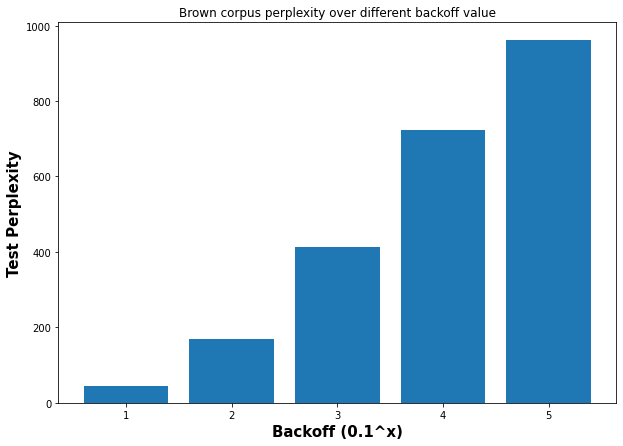
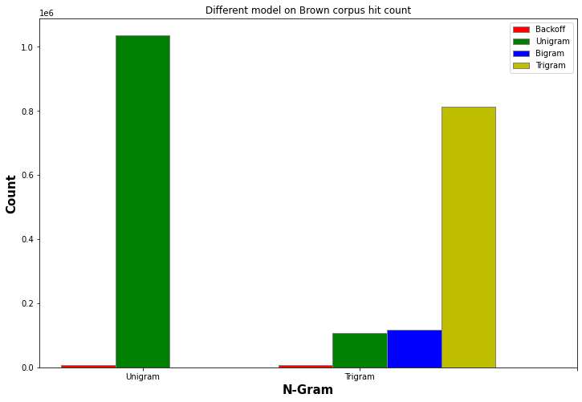

# Programming assignment 3: Language Modeling

## 2 Unigram Language Model Analysis (2.5 points)

### 2.1 Analysis on In-Domain Text (1 point)

| Model | Train | Dev | Test | Vocab |
| - | - | - | - | - |
|brown | 39802 | 8437 | 8533 | 41746 |
| reuters | 38169 | 8082 | 8214 | 36037 |
|gutenberg | 68740 | 14729 | 14826 | 43835|

> Numbers in table are number of sets

Here I compared across the three model provided: brown, reuters, and gutenberg along their perplexity. The table below shown the size of the set accordingly. We can see that gutenberg has larger training set compared with other models, and from the graph we can see that its perplexity is also on a lower side compared with other models. The two model with similar size of training set has similar performance. To sum up, we can see that the larger the training set is, the better the model perform in case of its perplexity.

### 2.2 Analysis on Out-of-Domain Text (1.5 points)

|train model/corpus | brown  |  reuters  |  gutenberg |
|--------- | ------- | --------- | -----------|
brown     | **1513.8**   |  6780.82   |  1758.06|
reuters   | 3806.39   | **1471.21**   |  4882.8|
gutenberg | 2616.57   | 12420.1    |   **982.572** |

dev model/corpus|   brown    |reuters    | gutenberg
--------- | -------  |--------- | -----------|
brown      |**1589.39**   | 6675.63  |    1739.41|
reuters    |3808.87   | **1479.09**   |   4833.88|
gutenberg  |2604.28   | 12256.3    |    **991.5** |

 test model/corpus  | brown    |reuters    |gutenberg
--------- | ------- | --------- | -----------
brown      |**1604.2**   |  6736.6   |    1762.01
reuters    |3865.16  |  **1500.69**   |   4887.47
gutenberg  |2626.05  | 12392.5     |  **1005.79**

> Numbers in table are perplexity

For all the matrix above, there is a trend that all model is doing their best (lower perplexity) when evaluating text within their own domains, and the perplexity goes higher when it is outside their domains. However, for domains that have different types, such as Gutenberg, which text are mostly from English playwright and novelist in 1600s, and Reuters, which are mostly financial news in 1987, would have a sky-rocketing increase of the perplexity when model is train on one and test on another.

## 3 Implement a Context-aware Language Model (10)

### Implementation Details

In this assignment, I tried to use a Trigram model with Katz Backoff. Backoff value was chosen as `1/(|v|)`. Each N-Gram calculate probability as `C(w_1, ..., w_n)/C(w_1, ..., w_(n-1)`. For each of the sentence, I use `<START>` as starting word placeholder if request `n>1` N-gram model, and `END_OF_SENTENCE` for STOP word accordingly. The model first counts corresponded set of for Trigram, Bigram, and Unigram, or use the Backoff value `0.001` for unknown word. Katz Backoff uses lower N if the higher one does not exist, and for Trigram, Bigram, Unigram, Unknown, weights lambda 0.4, 0.3, 0.2, and 0.1 are used accordingly.

### Compare with Unigram  

  

> Unigram graph shown on Question 2.1

Compared with Unigram model, Trigram with Katz Backoff have better performance than Unigram, in perspective of perplexity. It is also clear that the dev model is a good indicator of how model perform on the test set. Our model, compared with Unigram, seems to have better performance over the Reuter's set as it has the best perplexity value among the three corpus, while Unigram model has better fit over gutenberg's corpus among the tree model train on Unigram.

#### Hyperparameter  

We tried to decrease backoff value from high to low and find the model performance over perplexity has decreased (value being larger). For lambda, we have manually tried several of them but as there are four parameters could be added together, we shown the final one we have chosen as describe above. The image shown here keeps all value but changed the backoff value and show the performance.

  

#### Model Preference

Here I choose the following three sentences/phases and as model trained in different domains for scores of `perplexity`:

- "To be or not to be"
- "What is the weather like today"
- "Tesla posted a record 3.3 billion profit in the first three months of 2022 with sales of its vehicles up 81% from last year"

|Sentence|brown|reuters|gutenberg|
|---|---|---|---|
|To be or not to be | 80.8518  |  111.185   |  **36.5207**
Make America great again |      **284.948** |  636.236   |   300.25|
Tesla posted a record 3.3 billion profit in the first three months of 2022 with sales of its vehicles up 81% from last year | 1601.09 |  **681.066**  |  2879.66|

> Values in the table are perplexity over the sentence, the lower means the model is more familiar with the sentence

The models has shown preference e.g. brown would prefer more on American style daily used language, Gutenberg is more likely to think poem related phases, and Reuters mark higher prob on data/financial related sentences.

### Out of Domain Text Analysis

| train model/corpus  |  brown  |  reuters  |  gutenberg |
|--------- | --------- | ---------  |-----------|
brown    |    11.5691  |3617.13    |  1233.95
reuters  |  2120.66  |    11.9393  |  3438.49
gutenberg | 1410.18  |  6372.85   |     17.6011

dev model/corpus     |  brown |   reuters   | gutenberg
--------- | ------- | ---------|  -----------
brown   |    707.61 |  3583.35   |   1219.1
reuters  |  2127.48 |   173.943   |  3407.71
gutenberg | 1401.5  |  6320.11   |    315.698

test model/corpus      |  brown  |  reuters  |  gutenberg
--------- | ------- | --------- | -----------
brown    |   722.102  | 3598.24    |  1228.59
reuters  |  2167.25  |   179.808   |  3425.96
gutenberg | 1412.23  |  6334.4    |    320.118

> Unigram perplexity table could be find at Question 2.2

Trigram with Katz Backoff model has out-perform Unigram model in out-of-domain text. One possible reason is that Backoff model have considered more context (word to word relationship) compared with Unigram. As we can see from the image below:

Trigram has significant more times matching more precise context while Unigram has way less here. When checking with the dev/test set, model also have different percentage of context reference:

Unigram will either hit the word or not, but our Trigram with backoff can make use of precise context if exist, and as most of the word tested has matching context, it is also pretty clear that it could take more advantage than Unigram.

## Adoptions

In this section I choose to use mixed up brown and reuters model since they have similar data size. I tried to use model trained with brown and test set from reuters to calculate the perplexity. Two experiments has been done:

- Brown Training set + 5% Reuters train set
- Full mixed of brown and reuters

Baseline on the graph is Brown model's perplexity over Reuter's test set. As we can see from the graph, Trigram model improves a lot at the time cross-domain text has been added to the training set, and has nearly catch up with Reuter's model in full match.

