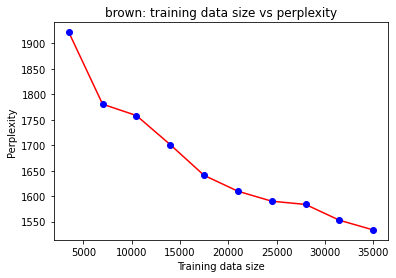
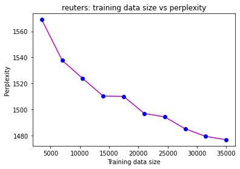
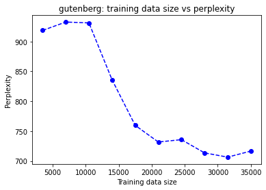

# Programming assignment 3: Language Modeling

## 2 Unigram Language Model Analysis (2.5 points)

### 2.1 Analysis on In-Domain Text (1 point)

Here I varies the training data availability and see how perplexity changed. As the training data availability increased, the model has its perplexity decreased. With more words is used, the model is able to get more familiar with the dataset, and thus have better performance. 

### 2.2 Analysis on Out-of-Domain Text (1.5 points)

|train model/corpus | brown  |  reuters  |  gutenberg |
|--------- | ------- | --------- | -----------|
brown     | **1513.8**   |  6780.82   |  1758.06|
reuters   | 3806.39   | **1471.21**   |  4882.8|
gutenberg | 2616.57   | 12420.1    |   **982.572** |

dev model/corpus|   brown    |reuters    | gutenberg
--------- | -------  |--------- | -----------|
brown      |**1589.39**   | 6675.63  |    1739.41|
reuters    |3808.87   | **1479.09**   |   4833.88|
gutenberg  |2604.28   | 12256.3    |    **991.5** |

 test model/corpus  | brown    |reuters    |gutenberg
--------- | ------- | --------- | -----------
brown      |**1604.2**   |  6736.6   |    1762.01
reuters    |3865.16  |  **1500.69**   |   4887.47
gutenberg  |2626.05  | 12392.5     |  **1005.79**

For all the matrix above, there is a trend that all model is doing their best (lower perplexity) when evaluating text within their own domains, and the perplexity goes higher when it is outside their domains. However, for domains that have different types, such as Gutenberg, which text are mostly from English playwright and novelist in 1600s, and Reuters, which are mostly financial news in 1987, would have a sky-rocketing increase of the perplexity when model is train on one and test on another.

## 3 Implement a Context-aware Language Model (10)

