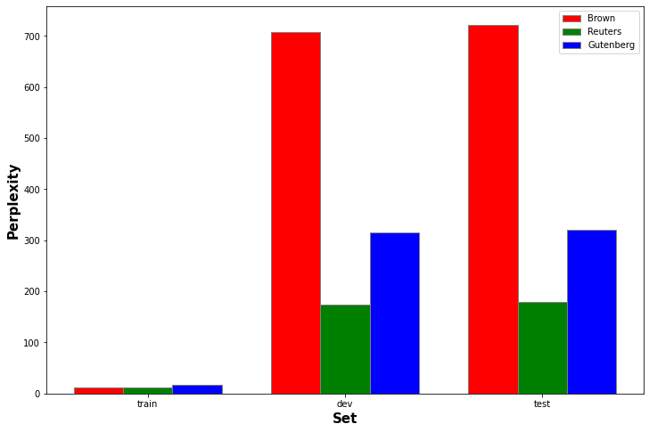
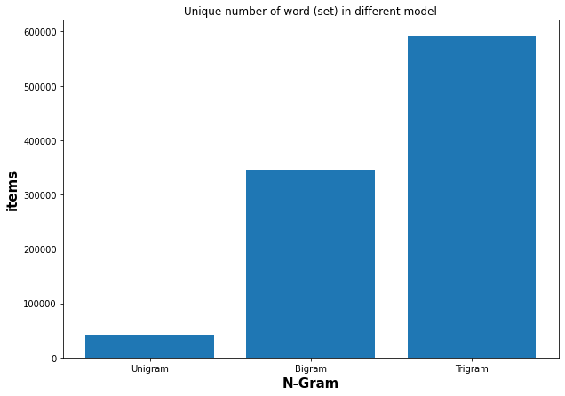

# Programming assignment 3: Language Modeling

## 2 Unigram Language Model Analysis (2.5 points)

### 2.1 Analysis on In-Domain Text (1 point)

| Model | Train | Dev | Test | Vocab |
| - | - | - | - | - |
|brown | 39802 | 8437 | 8533 | 41746 |
| reuters | 38169 | 8082 | 8214 | 36037 |
|gutenberg | 68740 | 14729 | 14826 | 43835|

Here I compared across the three model provided: brown, reuters, and gutenberg along their perplexity. The table below shown the size of the set accordingly. We can see that gutenberg has larger training set compared with other models, and from the graph we can see that its perplexity is also on a lower side compared with other models. The two model with similar size of training set has similar performance. To sum up, we can see that the larger the training set is, the better the model perform in case of its perplexity.

### 2.2 Analysis on Out-of-Domain Text (1.5 points)

|train model/corpus | brown  |  reuters  |  gutenberg |
|--------- | ------- | --------- | -----------|
brown     | **1513.8**   |  6780.82   |  1758.06|
reuters   | 3806.39   | **1471.21**   |  4882.8|
gutenberg | 2616.57   | 12420.1    |   **982.572** |

dev model/corpus|   brown    |reuters    | gutenberg
--------- | -------  |--------- | -----------|
brown      |**1589.39**   | 6675.63  |    1739.41|
reuters    |3808.87   | **1479.09**   |   4833.88|
gutenberg  |2604.28   | 12256.3    |    **991.5** |

 test model/corpus  | brown    |reuters    |gutenberg
--------- | ------- | --------- | -----------
brown      |**1604.2**   |  6736.6   |    1762.01
reuters    |3865.16  |  **1500.69**   |   4887.47
gutenberg  |2626.05  | 12392.5     |  **1005.79**

For all the matrix above, there is a trend that all model is doing their best (lower perplexity) when evaluating text within their own domains, and the perplexity goes higher when it is outside their domains. However, for domains that have different types, such as Gutenberg, which text are mostly from English playwright and novelist in 1600s, and Reuters, which are mostly financial news in 1987, would have a sky-rocketing increase of the perplexity when model is train on one and test on another.

## 3 Implement a Context-aware Language Model (10)

### Implementation Details

In this assignment, I tried to use a Trigram model with laplace smoothing (delta = 0.01). Delta was chosen with small number so unseen word won't For each of the sentence, I use `<START>` as starting word placeholder and `END_OF_SENTENCE` for STOP word accordingly. The model first counts corresponded set of word and normalized them afterward. Backoff value is set to `delta/(delta * |v|)` accordingly.

### Compare with Unigram

> Unigram graph shown on Question 2.1

Compared with Unigram model, Trigram model has a good understanding with training data set. It is also worth noticing that the training perplexity ratios across three domains are matching the dev and test Result.

Trigram has perform better train set over Unigram, but has worse result over dev and test. 

### Model Preference

Here I choose the following three sentences/phases and as model trained in different domains for scores `logprob sentence`:

- "To be or not to be"
- "Make America great again"
- "Tesla posted a record 3.3 billion profit in the first three months of 2022 with sales of its vehicles up 81% from last year"

|Sentence|brown|reuters|gutenberg|
|---|---|---|---|
|To be or not to be | -62.3846 | -67.614 | **-46.9252**|
Make America great again |      **-72.4445** |  -75.6862  |   -73.669|
Tesla posted a record 3.3 billion profit in the first three months of 2022 with sales of its vehicles up 81% from last year | -333.936 |  **-285.952**  |   -355.299|

The models has shown preference e.g. brown would prefer more on American style language, Gutenberg is more likely to think poem related phases, and Reuters mark higher prob on data/financial related sentences.

### Out of Domain Text Analysis

| train  |  brown  |  reuters  |  gutenberg |
|--------- | --------- | ---------  |-----------|
|brown  |      342.571 | 22665.5     | 16704.4
|reuters |   17124.8    |  189.834    |24005.7
|gutenberg | 14390.2    |28658.1       | 257.199|

dev    |  brown |   reuters   | gutenberg
--------- | ------- | ---------|  -----------
brown     | 10616.3  | 22670.9  |    16653.2
reuters   | 17275     | 2279.39  |   23997.3
gutenberg | 14369.4   |28700.7    |   4033.32

test     |  brown  |  reuters  |  gutenberg
--------- | ------- | --------- | -----------
brown      |10733.3  | 22673.2   |   16566.3
reuters    |17363.7   | 2345.64   |  23867.7
gutenberg  |14449     |28615.2     |  4079.38

> Unigram table could be find at Question 2.2

Unigram has out-perform Trigram model in out-of-domain text. One possible reason is that Trigram have more chances to mark things into "unseen` categories compare with Unigram.

Trigram has significant more times triggering backoff while Unigram has way less here, which could be the reason why Unigram may be a better choice if training set has few overlap with test/application set while Trigram suffered. It is also worth mentioning that laplace smoothing may contribute parts of the performance factor. 

## Adoptions

In this section I choose to use mixed up brown and reuters model since they have similar data size. I tried to use model trained with brown and test set from reuters to calculate the perplexity. Two experiments has been done:

- Brown Training set + 5% Reuters train set
- Full mixed of brown and reuters

Baseline on the graph is Brown model's perplexity over Reuter's test set. As we can see from the graph, Trigram model improves a lot at the time cross-domain text has been added to the training set. Still, there is some gap toward Reuter's model.

